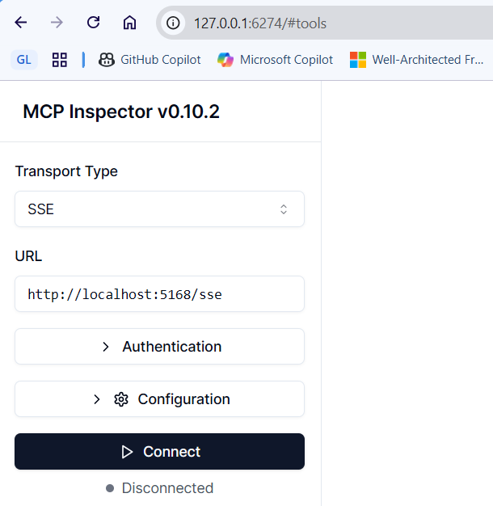
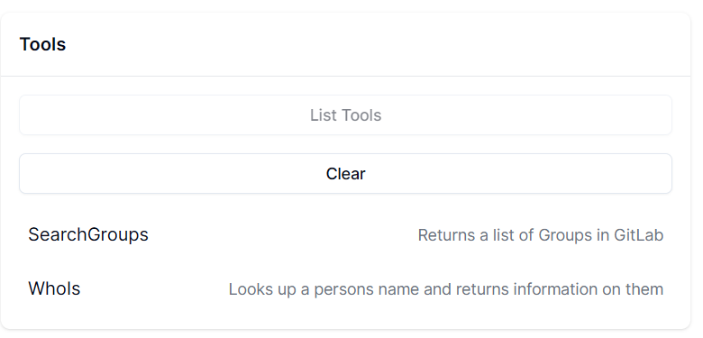

# MCP Server Example

This project demonstrates a basic implementation of an MCP (Model Context Protocol) server using .NET. It provides endpoints for interacting with MCP clients and includes tools for testing and debugging, such as the MCP Inspector. The example also shows how to integrate with external services like GitLab using user secrets for configuration.

## How to run

>[!NOTE]
> To run the GitLabTool (SearchGroupsAsync), follow the instructions [here](#user-secrets)

```bash
dotnet build
dotnet run
```

You'll see an output similar to this:

```
Building...
info: Microsoft.Hosting.Lifetime[14]
      Now listening on: http://localhost:5168
info: Microsoft.Hosting.Lifetime[0]
      Application started. Press Ctrl+C to shut down.
info: Microsoft.Hosting.Lifetime[0]
      Hosting environment: Development
```

Copy the Http URL as you'll need this when you run the MCP Inspector (see the next section).


## How to debug/test

If you're not receiving the responses you expect, or if you want to test and interact with your MCP server(s) outside of the VSCode environment, you can use the MCP Inspector. This tool provides a user-friendly interface for testing and debugging your MCP servers. [Access the MCP Inspector source code here](https://github.com/modelcontextprotocol/inspector).

To install the inspector, enter this into your terminal:

```bash
npx @modelcontextprotocol/inspector dotnet run
```

This then starts the MCP Inspector.  Click on the HTTP URL to access the Inspector:

```bash
Starting MCP inspector...
⚙️ Proxy server listening on port 6277
🔍 MCP Inspector is up and running at http://127.0.0.1:6274 🚀
New SSE connection
```

Using the HTTP Url you copied earlier, select the **Transport Type** dropdown and set to `SSE` and paste this into **URL** (please add `/sse` to the end) text box and press the `Connect` button:

.

To see what tools are available, now press the `List Tools` button (located in the centre of the UI). This will reveal:



Now it's over to you to experiment!

## User Secrets

If the project is missing a `<UserSecretsId>` then run this to setup user secrets for this project:

```
dotnet user-secrets init
```

GitLab PAT

```bash
dotnet user-secrets set "GitLab:Token" "<your-token-value>"
```

GitLab Domain

```bash
dotnet user-secrets set "GitLab:domain" "<your-domain-value>"
```